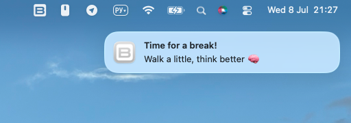
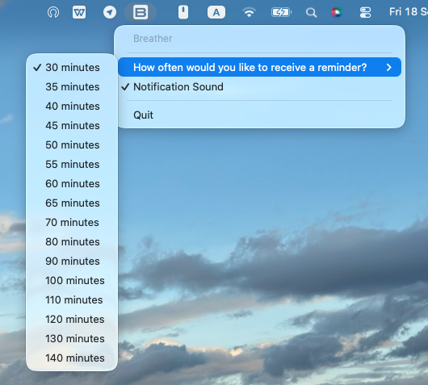

# Breather

A tiny macOS menu bar app that reminds you to take a break.

A simple nudge to stand up, stretch, drink water, and look away from the screen - just a reminder so you don't spend the whole day in one chair.

---

---

## Features

- Choose a reminder interval from 30 to 140 minutes.
- Receive a macOS notification when it is time for a break.
- Get a random message each time, for example my favorite `Don't become part of the chair` :D
- Turn notification sounds on or off.

---

---

## Installation
- Download [the ZIP file for macOS](https://github.com/KhachatryanRafayel/breather/releases/download/v0.1.0/Breather-macOS-arm64.zip)
- Unzip and drag Breather.app to Applications
- Open the app
- If macOS blocks it as "unidentified developer": Cancel → System Settings → Privacy & Security → Open Anyway
- Allow notifications — the app now lives in your menu bar

## License
MIT, see [LICENSE](LICENSE).
